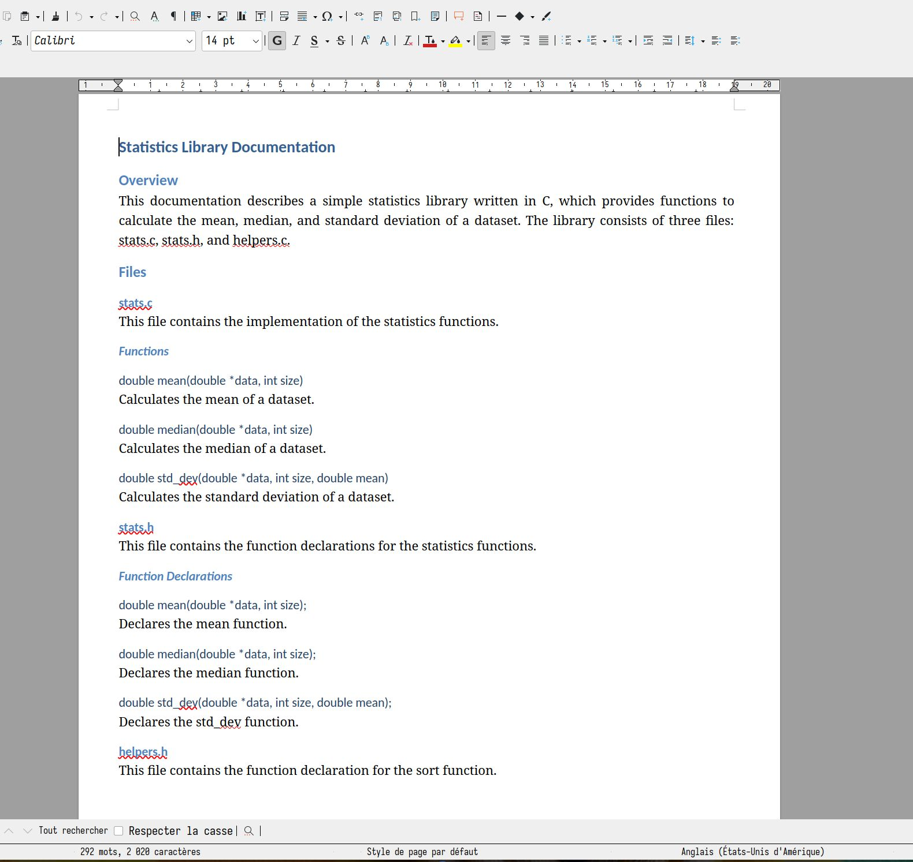

# AutoDocGen

## Description

a powerful Python application designed to streamline code documentation. Leveraging multiple API service providers such as Groq, Mistral, OpenAI, Cohere, and Google, CodeDocAI automatically generates comprehensive and concise documentation for any codebase. With just a few clicks, CodeDocAI produces detailed explanations and generates professional-grade PDF or DOCX files, making it easier than ever to understand and share your code.

### Preview



## Table of Contents

- [Installation](#installation)
- [Usage](#usage)
- [Contributing](#contributing)
- [License](#license)

## Installation

To get started with this project, clone this repository and install the required dependencies.

```bash
# Clone the repository
git clone https://github.com/rzafiamy/AutoDocGen.git
cd AutoDocGen
```

## Install dependencies

```bash
pip install -r requirements.txt
```

## Usage

The `manager.py` script is used to interact with different API providers and document files located in a specified folder. Below is how you can use this script:

### Basic Command Structure

```bash
python manager.py --code <folder name> --provider {openai|groq|mistral} --token <mytoken>
```

### Required Arguments

- `--provider {openai,groq,mistral}`: Specify the API provider. This is a required argument to determine which service the script interacts with.
- `[--code CODE]`: Specify the folder path where files to be documented are located.
- `[--token TOKEN]`: Provide your API token for authenticating with the chosen provider.

### Optional Arguments

- `[-h]`: Show the help message and exit.

- `[--num_files NUM_FILES]`: Set the maximum number of files to read recursively from the specified folder.
- `[--max_chars MAX_CHARS]`: Define the maximum number of characters to parse from each file.

### Examples

Here are some example usages of the script:

```bash
# Document files using OpenAI's API from a specific folder
python manager.py --provider openai --code path/to/folder --token your_token_here --num_files 10 --max_chars 5000

# Document files with a set character limit from a folder using Groq's API
python manager.py --provider groq --code another/path --token your_token_here --max_chars 3000

# Read files recursively from a folder without a character limit using Mistral's API
python manager.py --provider mistral --code some/path --num_files 5 --token your_token_here
```

## Contributing


## License

Distribute under the Apache 2.0 License. See LICENSE for more information.